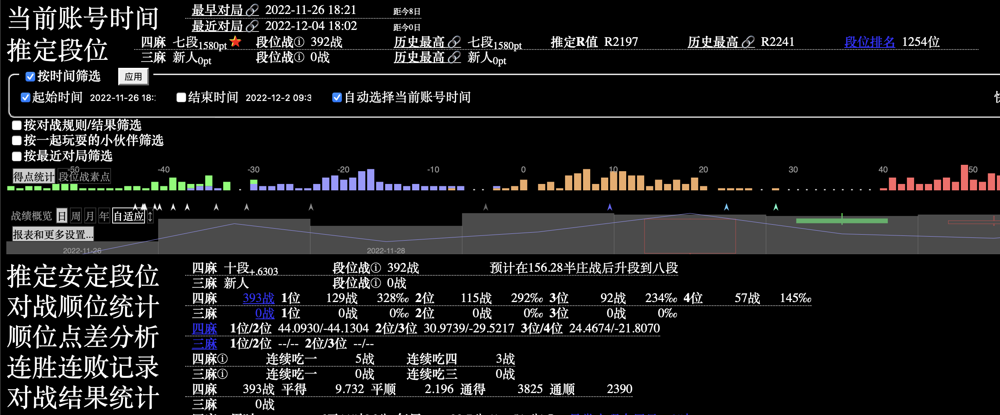
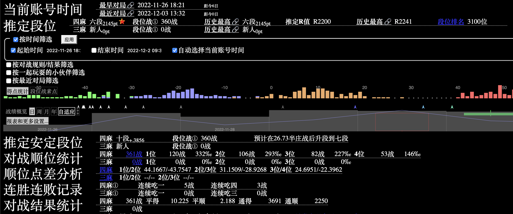
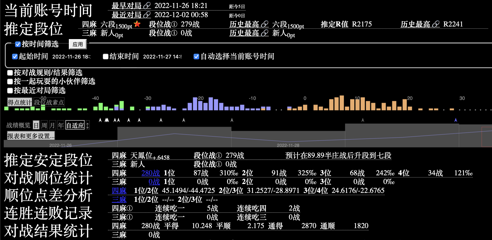

# MahjongAI
[](https://github.com/moxcomic/MajsoulAI/releases/latest)  

```diff
- 由于雀魂不允许AI进入, 所以会封号, 请不要使用大号进行登录和使用
```
软件已支持Windows版本，教程没更新而已，Windows本直接自动即可。

## 关于新AI的开发

已上线公测。

## 关于为什么收费
毕竟不能变成闲鱼商贩的赚钱工具。

### 中国大陆无法加载问题

如果你在中国大陆内使用本软件，可能会遇到卡加载进度条、日服美服无法登陆等问题，遇到此问题的原因是雀魂的服务器架设在非大陆地区，您可能需要使用代理才能够正常的访问。

这里我们以[PandaVPN](https://www.pantavv.xyz/i/27611920)进行举例，首先我们安装并打开VPN，登录后连接上可用的线路，之后修改`config.proxy.json`即可正常访问

```json
{
  "enbale": true,        // true开启代理 false关闭代理
  "mode": "socks5",      // 代理模式, 仅支持socks5和http
  "host": "localhost",   // 代理ip
  "port": 1090           // 代理端口
}
```

## Results

### Tenhou

(2022年12月04日)



(2022年12月03日)



(2022年12月02日)



(2022年12月01日)


### Majsoul

(2022年11月30日)


(截至 2021 年 10 月 14 日)


### Author

---

B 站 ID: [神崎·H·亚里亚](https://space.bilibili.com/898411/)  
B 站 ID: [关野萝可](https://space.bilibili.com/612462792/)  
QQ 交流群: [991568358](https://jq.qq.com/?_wv=1027&k=3gaKRwqg)  
Discord: [JoinDiscord](https://discord.gg/eNKz25Xf3r)

<figure class="third">
    
</figure>
