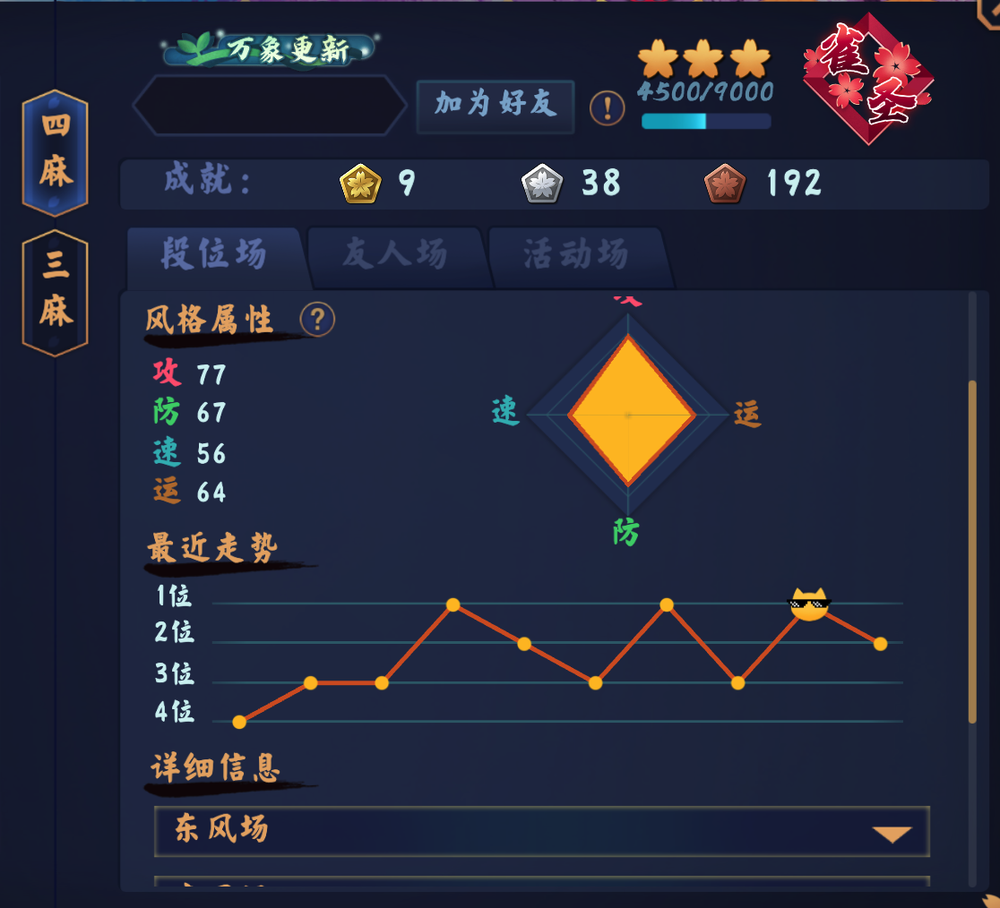
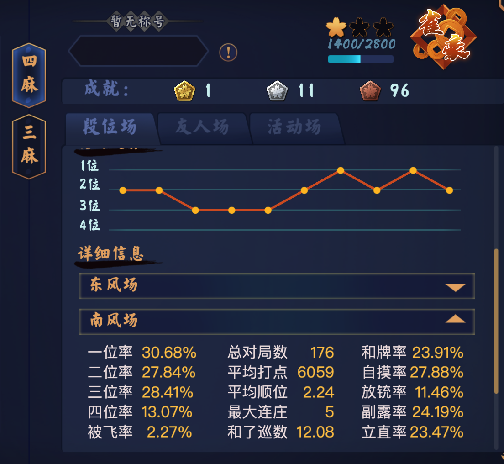
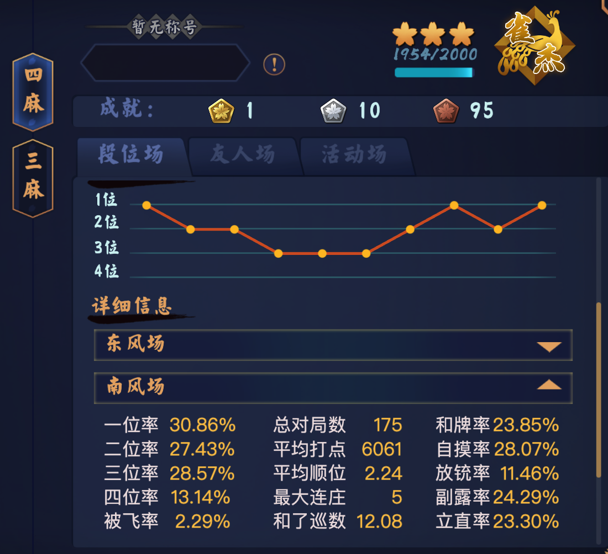
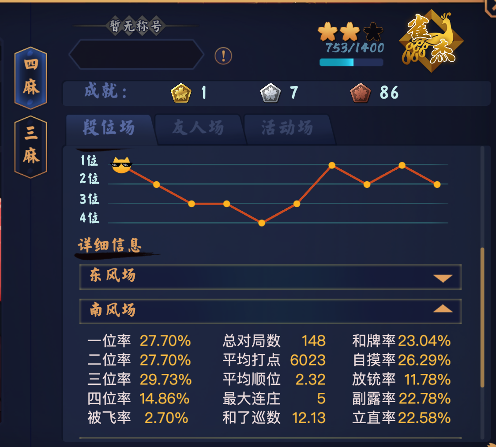
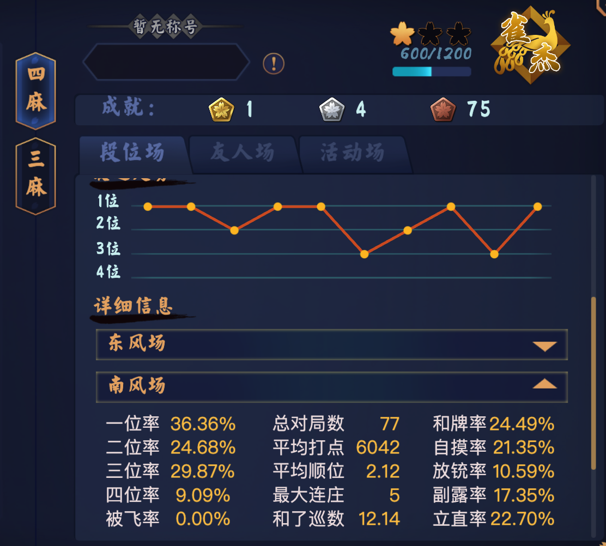
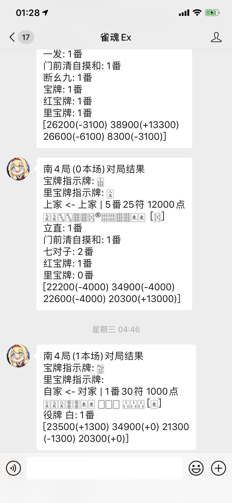

# MajsoulAI
[ ](https://github.com/moxcomic/MajsoulAI/releases/latest)

使用请先加群或Discord频道, 最新版本已不在github发布. 最新版本再docker hub发布, github下载版本已停用.

## 测试结果
(截至 2021 年 10 月 14 日)

(截至 2021 年 09 月 09 日)

(截至 2021 年 09 月 08 日)

(截至 2021 年 09 月 08 日)

(截至 2021 年 09 月 07 日)

(截至 2021 年 09 月 01 日)

(截至 2021 年 08 月 15 日)

(截至 2021 年 08 月 30 日 | 无东场)

(截至 2021 年 08 月 30 日 | 无东场)


## 如何运行
1. 安装docker
2. 使用cmd或powershell执行以下命令(注意空格, 复制时不要漏掉空格否则无法执行)
```shell
docker pull moxcomic/mjai
docker run -itd --name ai moxcomic/mjai /bin/bash
docker ps
    这里会得到如下输出
    CONTAINER ID   IMAGE          COMMAND       CREATED       STATUS      PORTS     NAMES
    2b9c0ff81e96   6a7ed490783d   "/bin/bash"   2 weeks ago   Up 6 days             ai
docker exec -it [CONTAINER ID] /bin/bash
    这里的[CONTAINER ID]需要进行替换
    例如这里替换后的命令为: docker exec -it 2b9c0ff81e96 /bin/bash
cd ai
./mjai
```

## 登录后命令
```
当前可用命令:
logout: 登出账号
join: 进入友人房, 例子: join 10086
ready: 友人房准备
auto: 自动匹配开始
info: 调试输出
exit: 打完当前对局后退出
```

## 配置微信推送对局结果

1、企业微信注册[https://work.weixin.qq.com/wework_admin/register_wx?from=loginpage](https://work.weixin.qq.com/wework_admin/register_wx?from=loginpage)

```diff
- 这里随便填写注册即可, 不需要验证
```


2、企业微信登录

登录地址：[https://work.weixin.qq.com/wework_admin/loginpage_wx?from=myhome](https://work.weixin.qq.com/wework_admin/loginpage_wx?from=myhome)

使用管理员微信扫描二维码即可登录。

如果是刚注册的企业微信，则注册成功即为登录状态。
3、获取企业ID （corpid）

登录成功后，切换到“我的企业”，拉到最下面，找到企业ID，后面需要这个企业ID。

4、创建一个内置应用

登录成功后，切换到“应用管理”，找到“自建”，然后点击“创建应用”。


选择logo，填写应用名称和简介，选择成员，点击“创建应用”。

此处只能选择已经申请加入到企业的成员，后面可以邀请加入企业。
5、获取创建应用的agentid和corpsecret

点击第4步中创建的应用，就可以看到agentid。

secret需要下载企业微信手机App后在网页点击查看secret后在手机端App查看。
6、将得到的内容输入config.json
```shell
// 在 /ai 目录下执行以下命令
vim config.json
// 然后将以上内容填入 qy_wechat 对应区域
// vim命令使用方式请参照百度
```

## Author

---

B 站 ID: [神崎·H·亚里亚](https://space.bilibili.com/898411/)  
B 站 ID: [关野萝可](https://space.bilibili.com/612462792/)  
QQ 交流群: [991568358](https://jq.qq.com/?_wv=1027&k=3gaKRwqg)  
Discord: [JoinDiscord](https://discord.gg/eNKz25Xf3r)

请作者喝一杯咖啡

<figure class="third">
    
    
    
</figure>
