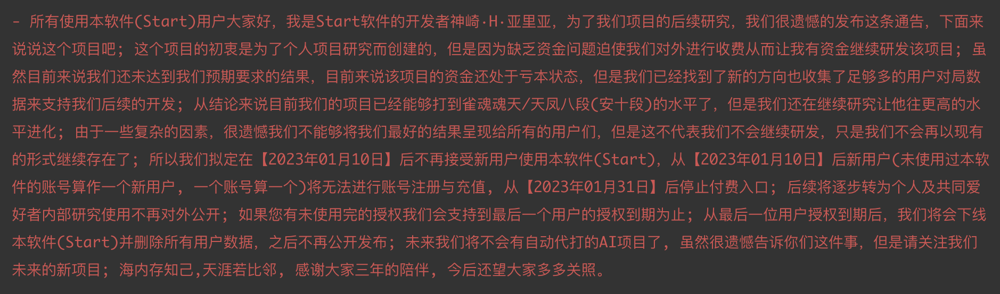

# MahjongAI
  

## 新项目进度公告

新项目目前已经在测试中，感谢`牌谱屋`的数据支持和帮忙宣传新项目，我们将会在近期内公布新项目。

新项目演示视频：[bilibili](https://www.bilibili.com/video/BV1pY4y1f7M8/?vd_source=95802807d6ccce7bed8e5b090598c3b6)

## 致所有用户的一封信

### Attention

[Twitter](https://twitter.com/Start_MahjongAI/status/1601725023949320192)

## Results

Tenhou

(2022年12月08日)

### Majsoul

(2022年11月30日)

(截至 2021 年 10 月 14 日)

### Author

---

B 站 ID: [神崎·H·亚里亚](https://space.bilibili.com/898411/)  
B 站 ID: [关野萝可](https://space.bilibili.com/612462792/)  
QQ 交流一群: [991568358](https://jq.qq.com/?_wv=1027&k=3gaKRwqg)  
QQ交流二群: [286427192](https://jq.qq.com/?_wv=1027&k=V0FYWAvF)  
Discord: [JoinDiscord](https://discord.gg/eNKz25Xf3r)  
Twitter: [Start_MahjongAI](https://twitter.com/Start_MahjongAI)