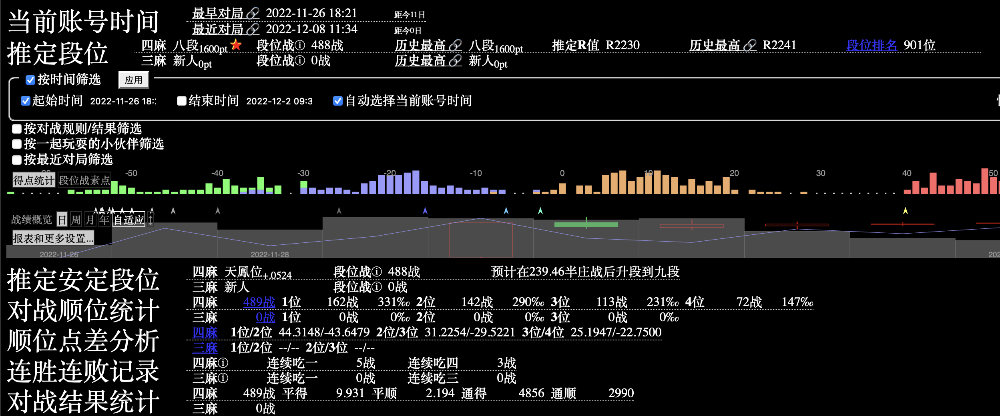

# MahjongAI
[](https://github.com/moxcomic/MajsoulAI/releases/latest)  

```diff
- 由于雀魂不允许AI进入, 所以会封号, 请不要使用大号进行登录和使用
- 为了项目研究发展需要，凡是涉及以下行为的查到立刻封禁授权：
雀魂：
- 禁止使用非本人账号登录使用
- 禁止进入王座对局
- 禁止参加任何官方/非官方举办的比赛
- 禁止任何形式的代练
天凤：
- 禁止使用非本人账号登录使用
- 禁止进入凤桌对局
- 禁止参加任何官方/非官方举办的比赛
- 禁止任何形式的代练
```
## Results

Tenhou

(2022年12月08日)



### Majsoul

(2022年11月30日)


(截至 2021 年 10 月 14 日)


### Author

---

B 站 ID: [神崎·H·亚里亚](https://space.bilibili.com/898411/)  
B 站 ID: [关野萝可](https://space.bilibili.com/612462792/)  
QQ 交流一群: [991568358](https://jq.qq.com/?_wv=1027&k=3gaKRwqg)  
QQ交流二群: [286427192](https://jq.qq.com/?_wv=1027&k=V0FYWAvF)  
Discord: [JoinDiscord](https://discord.gg/eNKz25Xf3r)  
Twitter: [Start_MahjongAI](https://twitter.com/Start_MahjongAI)